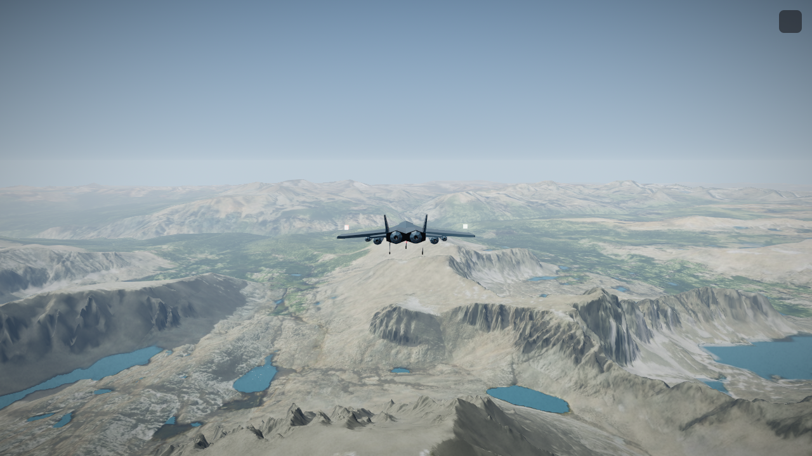
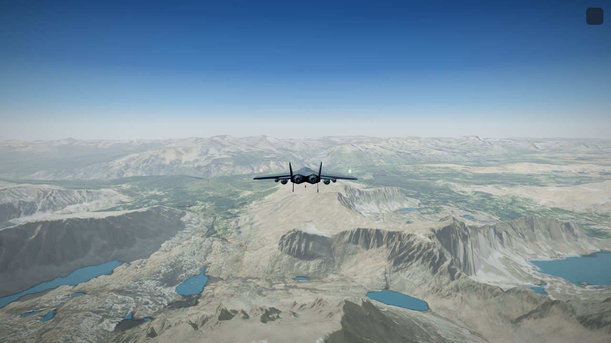
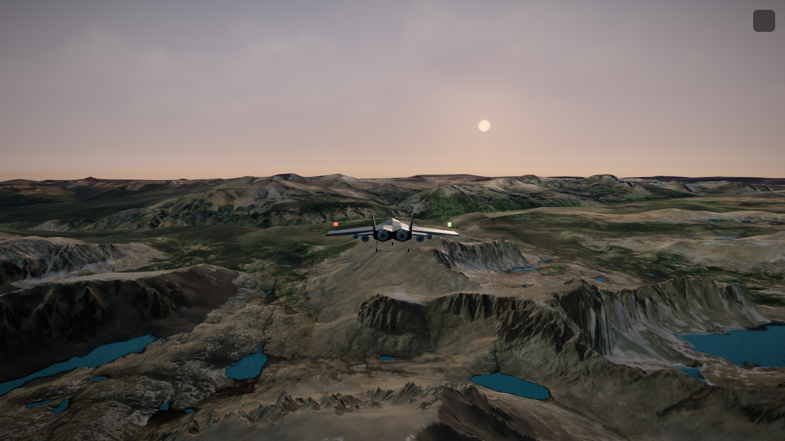
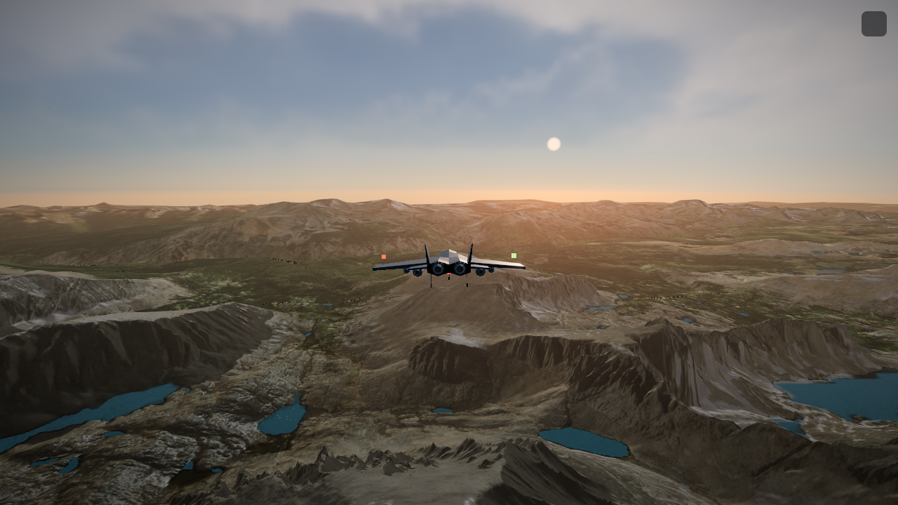
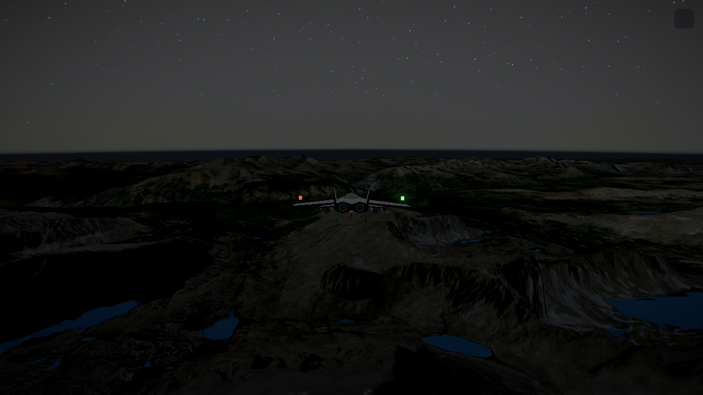
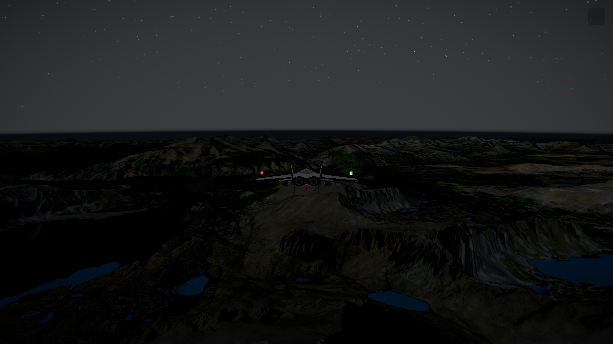

# Clear Sky visuals: implementation and release

> Painterly Flight integration: the record below describes the earlier Clear Sky
> release. [PAINTERLY_FLIGHT.md](PAINTERLY_FLIGHT.md) is the current visual record.
> The Painterly Flight plan keeps Classic as the initial profile until visual
> acceptance and hardware checks pass; existing saved preferences remain honored.

2026-09-24. Branch `codex/clear-sky-visuals`, based on `main` at `2fb97b2`.
Implementation commit `724ccf2`. This is the resumed visual half of
[Round 25](FLY_ROUND25_PLAN.md), recovered from the saved SKY (`11d1f8d`)
and GROUND (`4bc873e`) branches through merges `ff617ac` and `64ea151`.

**Release configuration approved by the user on 2026-09-24:** Enhanced is now
the default, and publication to main is authorized. Explicit saved Classic
preferences remain honored. Runtime checks pass; the appearance follow-ups below
remain open and are not represented as passing. The original checkout, its staged
files and its development server are preserved during publication.

## Try it

Enhanced is selected automatically when no visual preference is saved. Open
**Settings → Visuals** to switch between Enhanced and Classic live, then fly in
Satellite. The isolated development preview is `http://localhost:3020`.
The evidence below was captured before the default changed; it explicitly tests
both profiles and remains applicable to their rendering behavior.

## What is implemented

| Area | Preview behavior |
| --- | --- |
| Sky and atmosphere | Analytic Rayleigh/Mie sky with a shared sun model for haze, fog, horizon, clouds and environment orientation. Atmospheric exposure is applied before tone mapping. |
| Clouds | Distance fade from 16 to 22 km, integrated with the atmosphere. The dedicated cloud-cut appearance measurement is still inconclusive. |
| Terrain | 128×128 relief maps from full DEM data, bounded sun shading, and high-quality magnification sharpening. Existing terrain mesh resolution is retained. |
| Live switching | Resident Classic tiles receive relief without reloading imagery or replacing geometry. Two background DEM decodes maximum; stale results are discarded and failures have a retry delay. |
| Resource lifetime | Switching back to Classic or Neon releases the Enhanced terrain textures. Returning to Enhanced restores their shader bindings. Engine disposal releases associated warm-up resources. |

`R25_SKY` and `R25_GROUND` are enabled for the Enhanced profile. Color
reference transfer, quilt retirement and mesh refinement remain **disabled**.
The current ground feature uses at most approximately **4.00 MiB** of additional
GPU textures under the 5.5 MiB budget.

### Problems fixed while recovering the saved work

- **Missing detail after a stationary profile switch:** old resident tiles had
  never decoded relief. A bounded backfill now uses the existing cached DEM path.
- **Dark/patchy terrain after Enhanced → Classic → Enhanced:** Three caches the
  shader programs but stores one uniforms dictionary on each material. Reusing a
  cached Enhanced program lost its relief bindings after Classic compiled. The
  material now preserves the shared dictionary and its bindings.
- **Shader link failure with the shipped rendering settings:** the terrain
  material used 15 fragment texture samplers; relief used the 16th and the separate
  color-reference atlas required a 17th. WebGL rejected the program on the RTX
  5080. The atlas is disabled until it can share a sampler or the material's
  sampler budget is otherwise reduced. Quilt retirement stays disabled with it.
- **Resource retention across style/engine changes:** terrain textures, a retained
  color atlas and warm-up resources now have explicit cleanup.
- **Windows and measurement defects:** node shader comparisons normalize CRLF;
  the worker verifier resolves file URLs correctly. Real Sierra and Smokies
  camera poses use safe MSL altitudes instead of fixture-only heights that could
  place the camera below the actual mountains.

## Release default verification

After the user's default change, the exact release configuration passed a fresh
production build (10.4 s compile), ESLint and all 12 Classic compatibility checks.
A real RTX 5080 production-mode flight started in Enhanced with 95 resident relief
tiles and 4.00 MiB of relief textures. The governor and terrain pins remained null;
a separate fresh browser context respected a saved Classic preference. Zero
runtime or shader errors were observed. See
[the release default report](.graphics-review/r25-resume/release-default.json).

## Verification

All results below belong to this local pass, not the archived cloud venue.
The browser used headless Chrome with **ANGLE / NVIDIA RTX 5080 / D3D11** at
1280×720, with live Esri and OpenFreeMap access.

| Check | Result |
| --- | --- |
| Isolated production build | PASS; compiled in 12.2 s, all 9 static pages generated. |
| ESLint across the 12 changed implementation/check files | PASS. |
| Broader recovered rendering lint | Three existing `SkyDome.jsx` React immutability errors, reproduced on base `2fb97b2`; not introduced by this branch. |
| SKY node checks | 49 PASS, 0 FAIL. Optional offline `glslangValidator` check BLOCKED because it is not installed. |
| GROUND node checks | 42 PASS, 0 FAIL, 1 NOT CALIBRATED (optional offline shader validator). Candidate feature tests explicitly enable the deferred atlas; these are arithmetic checks, not proof it fits the live shader. |
| Worker normals, skirt worker, vendor checks | PASS; vendor 34/34. |
| Classic/flag-off checks | 12 PASS; shader identity and constants outside the Round 25 blocks preserved. Comparison tag `r25-w0` resolves to scaffold `db78bdf`. |
| New relief backfill tests | PASS; concurrency, stale results, geometry replacement, eviction and retry covered. |
| Real-GPU integration check | **20 PASS**, zero page errors and zero shader errors. Resident fill, three profile round trips, quality changes, style switches, actual texture deletion/re-upload and moving flight covered. |

The real-GPU run deliberately does **not** call the fleet's `bootFly`, which pins
terrain and the governor. Both pins remained null. Pilot commands alone were
scripted for three identical 20-second, roughly 2.08 km approaches at Owens;
terrain LOD and the shipped governor remained active. All three stayed at high
quality. The final checked flight report is
[the runtime JSON](.graphics-review/r25-resume/runtime/report.json).

| Profile | p50 frame ms | p95 frame ms | Worst frame ms | p95 draws | p95 triangles | GPU texture MiB |
| --- | ---: | ---: | ---: | ---: | ---: | ---: |
| Classic, first control | 8.3 | 12.5 | 20.8 | 179 | 169,905 | 152.48 |
| Enhanced | 8.4 | 12.6 | 16.9 | 208 | 183,017 | 157.48 |
| Classic, second control | 8.3 | 12.5 | 25.0 | 207 | 182,319 | 153.48 |

Enhanced's p95 was **0.8% above both Classic controls**, within the 10% runtime
check. Program count stayed at 132. The initial control was still filling its
world content, so the draw/triangle differences are not attributable solely to
Enhanced. These short development-server legs are not a long soak, a mobile
measurement, a production-runtime test or full performance certification.

## Remaining appearance work

No appearance threshold was relaxed. The earlier appearance runs are retained
separately from the supported runtime result:

1. **Sky seam and brightness:** early SKY-only poses failed the relative seam
   target, and a cruise pose measured luminance 1.0889 against a 1.08 maximum.
   Exposure bias is now −0.06 stops, but the complete gate has not been rerun.
   Some seam samples intersect mountains; establish a valid sky/haze sampling
   mask and same-tree floor before attributing those measurements.
2. **Terrain detail and brightness:** the prior full-atlas GROUND run recorded
   **18 PASS / 9 FAIL / 1 NOT CALIBRATED**, including Sobel gains around 1.01
   (Sierra) and 0.90 (Smokies) against 1.15, and Owens luminance around 0.924
   against 0.95. The current ground value multiplier is 1.035 and the atlas is
   off. Re-run and tune the supported combination; those old values are not a
   passing result for this branch.
3. **Cloud cut:** the dedicated gate returned NOT CALIBRATED because Classic's
   measured cloud contribution at the cut was below its visibility precondition.
   Dusk seam samples improved, but were informational, not certified passes.
4. **Classic pixel round trip:** node shader identity passes. Some old browser
   pixel/count comparisons still include changing actors and streamed detail;
   isolate those contributors and retain the original numerical limits.
5. **Deferred features:** solve the color-reference sampler budget, then measure
   color seams before retiring the quilt. Keep mesh refinement off until its
   fixed-pose triangle/draw budgets are measured.
6. **Release checks:** finish the planned appearance matrix, broader production
   checks, mobile hardware checks and a longer moving-flight soak. The fresh
   production launch is verified above. The user approved Enhanced as the default
   while these follow-ups remain open. The earlier R22–R24 built-but-off lighting,
   depth and terrain experiments remain outside this implementation pass.

The [evidence manifest](.graphics-review/r25-resume/manifest.json) distinguishes
the supported configuration from previous diagnostic runs. It includes the
[prior ground report](.graphics-review/r25-resume/ground-prior-appearance-report.json),
[cloud/dusk report](.graphics-review/r25-resume/sky-cloud-dusk-report.json) and
[sampler failure diagnostic](.graphics-review/r25-resume/sampler-limit-diagnostic.json).

## Comparison images

Same Sierra pose at 5,000 m MSL; actual streamed terrain. Time is held separately
for daylight, dusk and deep night. These are review images, not pixel-identity
proof or evidence that every planned appearance gate passes.

| Time | Classic | Enhanced |
| --- | --- | --- |
| Day |  |  |
| Dusk |  |  |
| Deep night |  |  |

## Reproduce

Use separate build directories and ports so the active checkout is unaffected.
The runtime script requires local Chrome, Playwright and live tile-host access.

```powershell
$env:FLY_BUILD_DIR = '.next-clear-sky'
node node_modules/next/dist/bin/next dev --webpack --port 3020
# In a second shell in the same worktree:
$env:FLY_URL = 'http://localhost:3020'
node scripts/verify-clear-sky-runtime.cjs
node scripts/verify-relief-backfill.mjs
node scripts/verify-r25-flagoff.mjs
node scripts/verify-r25-ground.mjs
node --experimental-loader ./scripts/_r25-c-jsx-loader.mjs scripts/verify-r25-sky.mjs
# Production build, separately:
$env:FLY_BUILD_DIR = '.next-clear-sky-production'
node node_modules/next/dist/bin/next build --webpack
```
