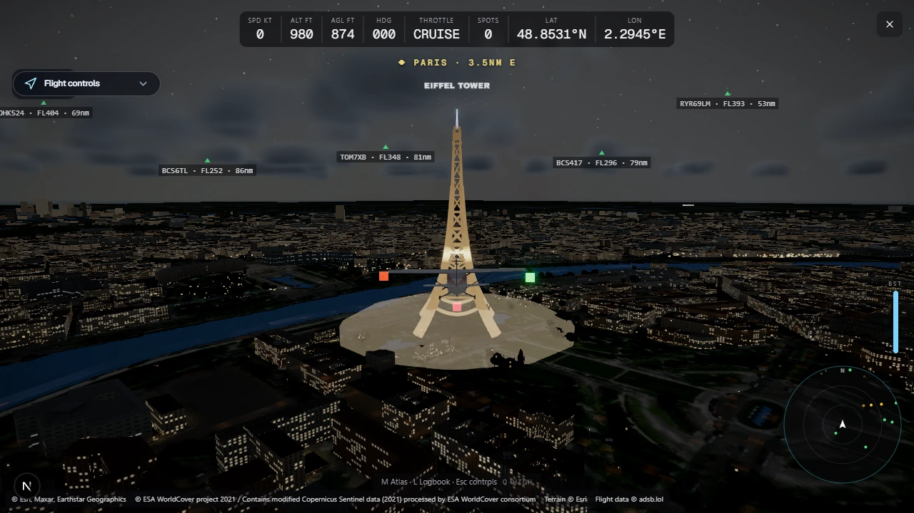
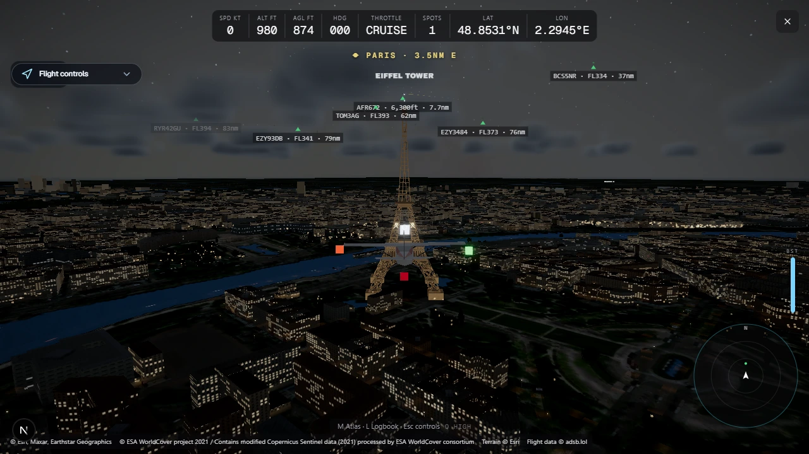
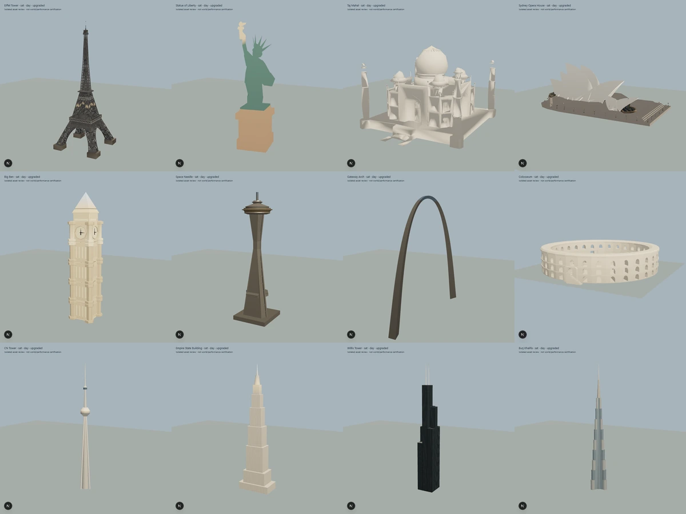
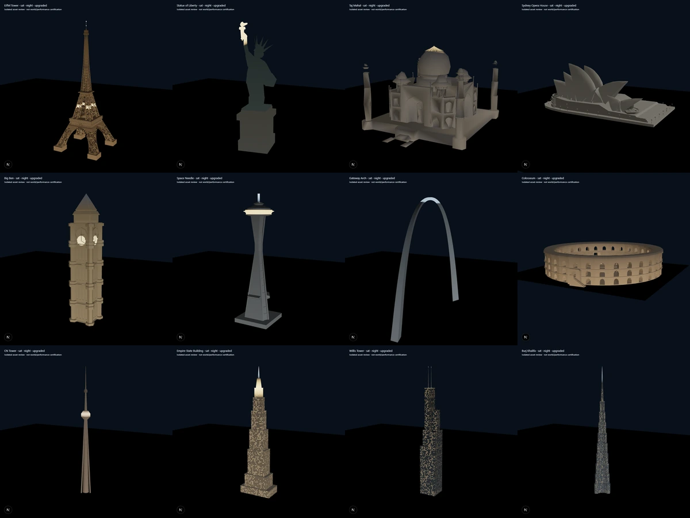
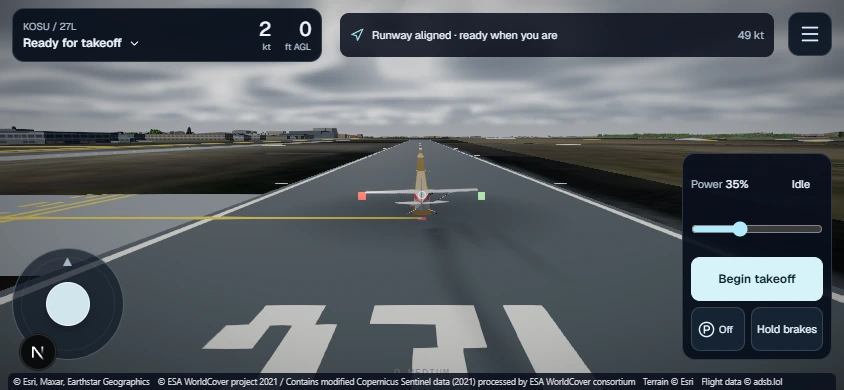
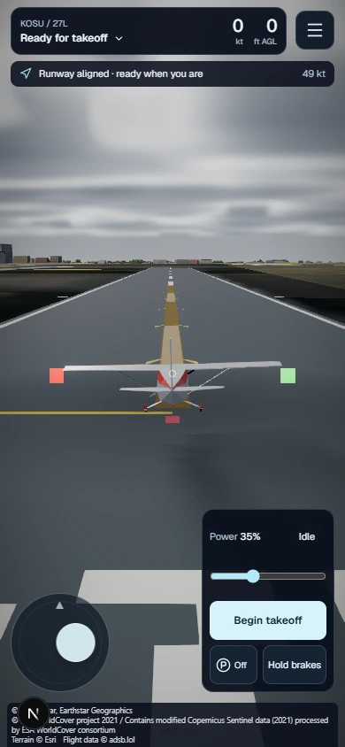
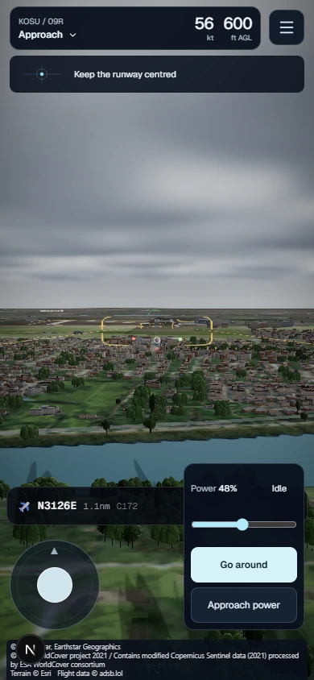
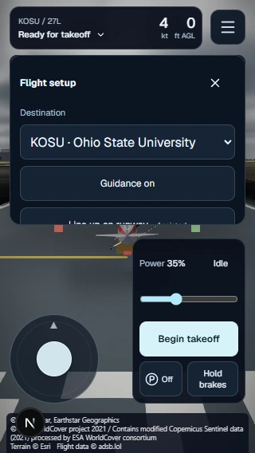

# Landmark and mobile review evidence

See [the implementation and provenance report](../../../LANDMARK_UPGRADES.md) for budgets, licensing, reproduction commands and test limitations.

## Results

- [World matrix checks](world-matrix-checks.json): ten checks pass across all 288 before/after world images.
- [World matrix metadata](world-matrix.json): twelve sites × two styles × three clock states × two distances × before/after. Fixed poses; Neon holds high quality for visual comparison, and uses its fixed palette at every clock state.
- [Asset matrix](asset-matrix.json): 144 isolated model/material images.
- [Moving flight](moving-flight.json): first hardware comparison at Eiffel and Empire State.
- [Detail transitions](detail-transitions.json): final hardware comparison at Eiffel and Burj; both meet the 10% p95 ceiling with the shipped governor and terrain settings unpinned. Transition-window peaks are 54.1 / 33.3 ms; no claim of stall-free rendering.
- [Runtime lifecycle](runtime.json): nine checks pass, including HTTP failure, warps, styles, tiers and fallback suppression.
- [Mobile interactions](mobile.json): 25 checks pass with Chrome touch emulation at 390×844, 844×390 and 320×568. Physical device performance is unmeasured.

The full-resolution PNG galleries remain locally at `.graphics-review/landmarks/index.html` (assets) and `.graphics-review/landmarks/world.html` (world), with their capture scripts committed under `scripts/`. These selected WebP images are high-quality derivatives for convenient Git review. Original PNGs and filenames are recorded in the raw reports.

## Eiffel at night

| Original representation | Detailed representation |
| --- | --- |
|  |  |

## Twelve-landmark appearance

## Mobile takeoff and approach

| Takeoff | Approach | Narrow-phone setup |
| --- | --- | --- |
|  |  |  |
